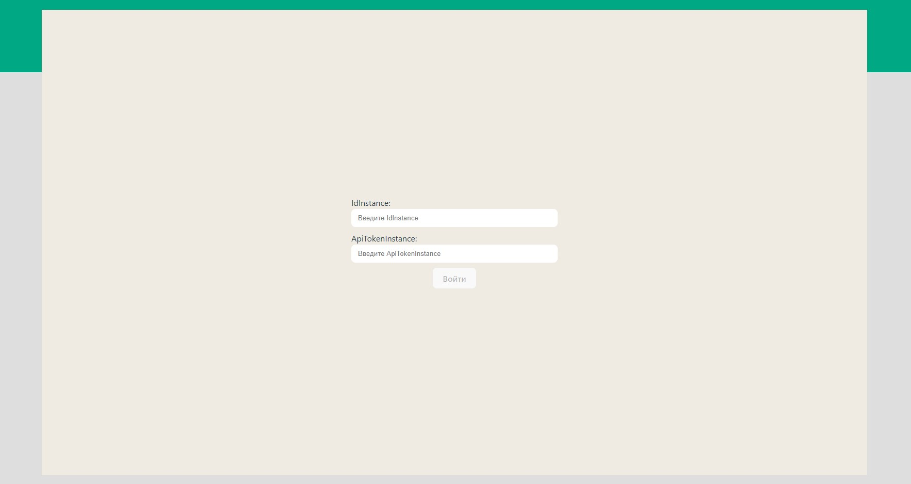
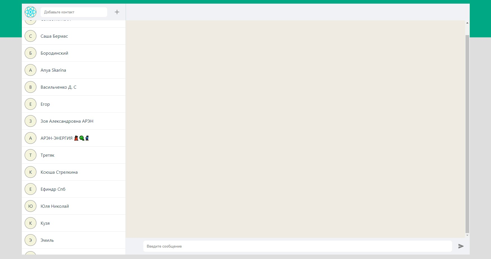

# Тестовое задание на должность "Фронтенд разработчик React"

В рамках тестового задания требуется разработать пользовательский интерфейс для
отправки и получений сообщений WhatsApp, используя сервис [Green-API](https://green-api.com/) .

Это приложение является тестовым заданием, позволяет отправлять и получать текстовые сообщения WhatsApp через HTTP API 
[Green-API](https://green-api.com/) (требуется регистрация). 

Входные данные для аутентификации:

- idInstance - номера аккаунта
- apiTokenInstance - ключа доступа

Рабочая версия приложение находится по ссылке: [WhatsAppWebClone](https://whats-app-web-clone-dmitrymarc.vercel.app/)






## Запуск приложения
Скачать zip-архив с репозитория [GitHub](https://github.com/DmitryMarc/WhatsAppWebClone) и распаковать, либо через консоль выполнить следующую команду:
```
git clone https://github.com/DmitryMarc/WhatsAppWebClone.git
```
Находясь внутри папки с проектом, установить зависимости
```
npm i
```

## Запуск проекта в режиме разработки
```
npm run dev
```
Далее перейти по ссылке [http://localhost:5173/](http://localhost:5173/)

## Сборка проекта
```
npm run build
```
Проект будет собран в папке ./dist
